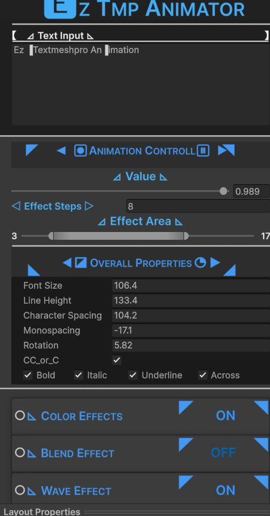
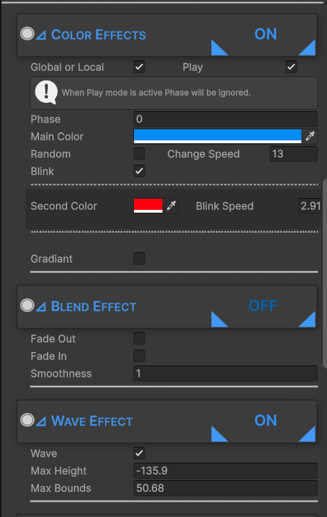
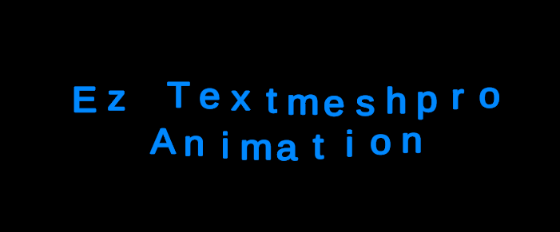
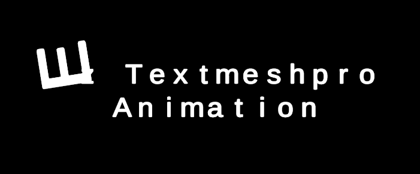
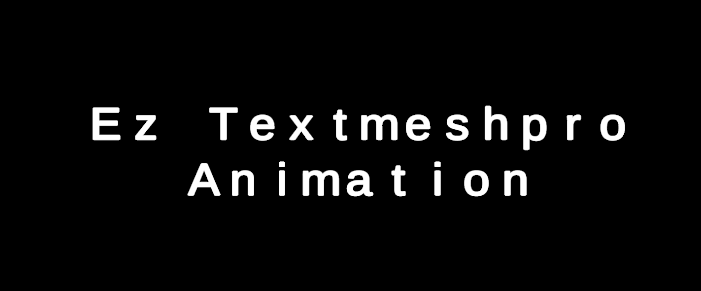
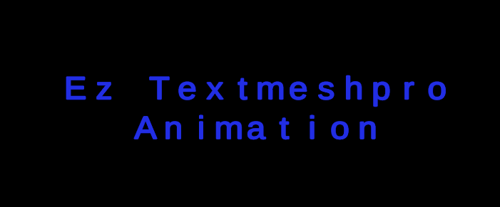
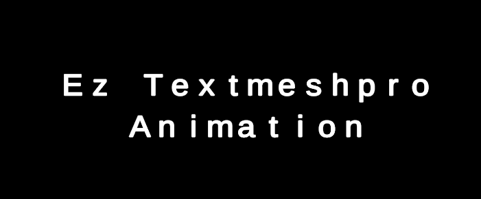

# EZ TMP Animator

**EZ TMP Animator** is a powerful and lightweight Unity tool designed to bring your **TextMeshPro** UI to life. It allows you to create complex, high-performance text animations by manipulating individual characters through rich text tags automatically.
---
<p align="center">


   
---

## 🚀 Features

* **Combine Multiple Effects:** Mix and match Wave, Zoom, Rotation, and Color effects simultaneously.
* **Advanced Color Control:** Supports solid colors, random color shifting, blinking effects, and animated gradients (Horizontal/Vertical).
* **Dynamic Character Effects:**
    * **Wave:** Bouncy sine-wave motions.
    * **Roll-in:** Spin characters into place with custom angles.
    * **Zoom Slide:** Dynamic scaling of individual letters.
    * **Fade In/Out:** Smooth alpha transitions for typewriter or reveal effects.
* **Performance:** Optimized to update only when changes occur, keeping your UI snappy.
* **Full Editor Integration:** Real-time preview directly in the Unity Scene View without pressing Play.

---

## 📸 Examples 
<p align="center">           </p>

## 🛠 Usage & Integration

### Control via Timeline or Code
The TMP Animator can be controlled manually or synchronized with other systems:
1.  **Manual Phase:** Use the `AnimatePhase` or `sliderValue` in the inspector to animate via **Unity Timeline** or Animation clips.
2.  **Scripting:** Access the component via code to change text or states dynamically:

```csharp
public TMP_Animation myAnimator;

void Start() {
    // Change text via script
    myAnimator.SetText("Hello World!");
    
    // Set animation progress (0.0 to 1.0)
    myAnimator.SetAnimationState(0.5f);
}
````
___

⚠️ Important Note on Control

```
The EZ TMP Animator takes full control over the attached TextMeshProUGUI component.
Managed by Animator: Text content, Size, Color, Spacing, and Spacing-Offsets.
Managed by TMP Component: Alignment/Orientation and Layout settings.
Please adjust all styling directly within the EZ TMP Animator inspector for it to take effect.
```
---
📂 Installation

   >1. Download wie unitypackage and drag and drop it in the project window to import.
   >2. Ensure you have TextMeshPro (TMP) installed via the Package Manager.
   >3. Add the TMP_Animation component to any GameObject that has a TextMeshProUGUI component.
   >4. The editor icons are linked via GUID to ensure they work even if you move the folder.

---

👤 Created by AzeS
🌐 [Visit my Website](https://www.azes-openeyes.de/)

---

📄 License

Free to use for everything! This tool is provided for free for both personal and commercial projects. You are free to modify, distribute, and use it forever.
